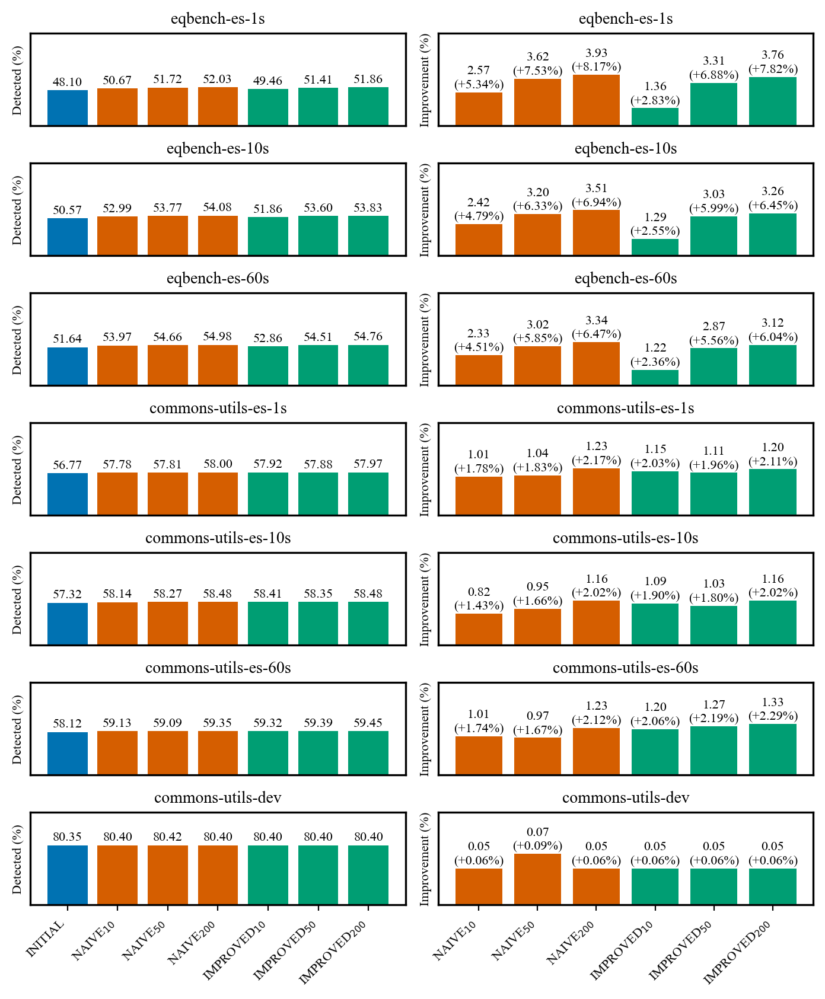

# RQ1 - Mutation-score improvement

_Source database: `postgres_dev`._

## Mutation score

The report covers 7 projects and 49 project-variant mutation summaries.

**Number of total, covered, and uncovered mutants in included classes per project.**

| Project | Included test methods | Included implementation classes | Total mutants | Covered mutants | Uncovered mutants |
| --- | --- | --- | --- | --- | --- |
| eqbench-es-1s | 3,937 (83.4%) | 607 (93.1%) | 23,905 | 21,492 (89.9%) | 2,413 (10.1%) |
| eqbench-es-10s | 4,049 (83.1%) | 600 (92.0%) | 23,654 | 21,657 (91.6%) | 1,997 (8.4%) |
| eqbench-es-60s | 4,124 (82.9%) | 603 (92.5%) | 23,663 | 22,010 (93.0%) | 1,653 (7.0%) |
| commons-utils-es-1s | 2,079 (83.8%) | 111 (44.9%) | 8,581 | 7,536 (87.8%) | 1,045 (12.2%) |
| commons-utils-es-10s | 2,330 (85.1%) | 112 (45.3%) | 8,391 | 7,939 (94.6%) | 452 (5.4%) |
| commons-utils-es-60s | 2,326 (85.0%) | 112 (45.3%) | 8,354 | 8,109 (97.1%) | 245 (2.9%) |
| commons-utils-dev | 461 (63.6%) | 90 (36.4%) | 8,096 | 5,215 (64.4%) | 2,881 (35.6%) |

source: [`compute_project_mutation_coverage`](https://github.com/glockyco/Teralizer/blob/b46ff655-dirty/analysis/src/teralizer/rq1_mutation_detection.py#L378)

**Mutation detection rates and improvements across projects and variants.**

source: [`compute_detection_improvements`](https://github.com/glockyco/Teralizer/blob/b46ff655-dirty/analysis/src/teralizer/rq1_mutation_detection.py#L400)

**Mutation detection rates by mutator.**

| Mutator | Total | Total % | Min % | Max % | Initial | Naive 200 | Naive Δ | Improved 200 | Improved Δ |
| --- | --- | --- | --- | --- | --- | --- | --- | --- | --- |
| Math | 61,841 | 59.10 | 52.34 | 62.16 | 50.99 | 54.98 | (+3.99) | 54.36 | (+3.37) |
| ConditionalsBoundary | 11,501 | 10.99 | 8.50 | 11.94 | 27.68 | 28.89 | (+1.21) | 30.23 | (+2.55) |
| RemoveConditionalOrderElse | 11,501 | 10.99 | 8.50 | 11.94 | 61.08 | 62.29 | (+1.21) | 62.47 | (+1.39) |
| PrimitiveReturns | 7,731 | 7.39 | 6.15 | 10.09 | 89.42 | 89.63 | (+0.20) | 89.90 | (+0.47) |
| RemoveConditionalEqualElse | 5,536 | 5.29 | 3.21 | 10.40 | 58.80 | 60.87 | (+2.07) | 61.00 | (+2.20) |
| InvertNegs | 3,122 | 2.98 | 2.94 | 3.12 | 58.91 | 60.61 | (+1.70) | 60.99 | (+2.08) |
| VoidMethodCall | 973 | 0.93 | 0.58 | 1.35 | 24.96 | 24.96 | -- | 25.49 | (+0.53) |
| NullReturnVals | 933 | 0.89 | 2.13 | 3.38 | 98.77 | 98.77 | -- | 98.77 | -- |
| BooleanTrueReturnVals | 569 | 0.54 | 0.17 | 1.44 | 98.55 | 98.55 | -- | 98.55 | -- |
| Increments | 546 | 0.52 | 0.50 | 0.54 | 72.81 | 73.38 | (+0.57) | 73.50 | (+0.69) |
| BooleanFalseReturnVals | 250 | 0.24 | 0.09 | 0.63 | 87.87 | 87.87 | -- | 87.87 | -- |
| EmptyObjectReturnVals | 141 | 0.13 | 0.41 | 0.43 | 90.30 | 90.30 | -- | 90.30 | -- |

source: [`compute_mutator_statistics`](https://github.com/glockyco/Teralizer/blob/b46ff655-dirty/analysis/src/teralizer/rq1_mutation_detection.py#L302)
