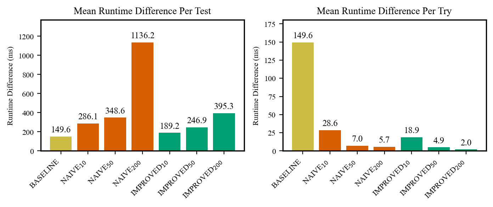

# RQ3 - Test-suite size and runtime

_Source database: `postgres_dev`._

## Test-suite size and runtime

**Number of tests before and after generalization, with changes, per project.**

| Project | Variant | Before | Added | Removed | After | Delta | Delta \% |
| --- | --- | --- | --- | --- | --- | --- | --- |
| eqbench-es-1s | NAIVE_200_TRIES | 4,718 | 177 | 177 | 4,718 | +0 | +0.0% |
| eqbench-es-1s | IMPROVED_200_TRIES | 4,718 | 206 | 206 | 4,718 | +0 | +0.0% |
| eqbench-es-10s | NAIVE_200_TRIES | 4,875 | 174 | 173 | 4,876 | +1 | +0.0% |
| eqbench-es-10s | IMPROVED_200_TRIES | 4,875 | 211 | 210 | 4,876 | +1 | +0.0% |
| eqbench-es-60s | NAIVE_200_TRIES | 4,974 | 174 | 174 | 4,974 | +0 | +0.0% |
| eqbench-es-60s | IMPROVED_200_TRIES | 4,974 | 210 | 210 | 4,974 | +0 | +0.0% |
| commons-utils-es-1s | NAIVE_200_TRIES | 2,481 | 60 | 59 | 2,482 | +1 | +0.0% |
| commons-utils-es-1s | IMPROVED_200_TRIES | 2,481 | 69 | 68 | 2,482 | +1 | +0.0% |
| commons-utils-es-10s | NAIVE_200_TRIES | 2,738 | 63 | 62 | 2,739 | +1 | +0.0% |
| commons-utils-es-10s | IMPROVED_200_TRIES | 2,738 | 70 | 69 | 2,739 | +1 | +0.0% |
| commons-utils-es-60s | NAIVE_200_TRIES | 2,735 | 60 | 59 | 2,736 | +1 | +0.0% |
| commons-utils-es-60s | IMPROVED_200_TRIES | 2,735 | 75 | 74 | 2,736 | +1 | +0.0% |
| commons-utils-dev | NAIVE_200_TRIES | 725 | 3 | 0 | 728 | +3 | +0.4% |
| commons-utils-dev | IMPROVED_200_TRIES | 725 | 3 | 0 | 728 | +3 | +0.4% |

source: [`_effects`](https://github.com/glockyco/Teralizer/blob/26a2c2ae6c0c02bd9182cb8749facb49b5d1fd99/analysis/src/teralizer/eval/reports/rq3_suite_size_runtime.py#L61)

**Number of test lines before and after generalization, with changes, per project.**

| Project | Variant | Before | Added | Removed | After | Delta | Delta \% |
| --- | --- | --- | --- | --- | --- | --- | --- |
| eqbench-es-1s | NAIVE_200_TRIES | 30,989 | 11,780 | 1,127 | 41,642 | +10653 | +34.4% |
| eqbench-es-1s | IMPROVED_200_TRIES | 30,989 | 19,019 | 1,302 | 48,706 | +17717 | +57.2% |
| eqbench-es-10s | NAIVE_200_TRIES | 32,503 | 11,520 | 1,061 | 42,962 | +10459 | +32.2% |
| eqbench-es-10s | IMPROVED_200_TRIES | 32,503 | 20,353 | 1,284 | 51,572 | +19069 | +58.7% |
| eqbench-es-60s | NAIVE_200_TRIES | 33,510 | 11,623 | 1,069 | 44,064 | +10554 | +31.5% |
| eqbench-es-60s | IMPROVED_200_TRIES | 33,510 | 20,288 | 1,285 | 52,513 | +19003 | +56.7% |
| commons-utils-es-1s | NAIVE_200_TRIES | 16,563 | 3,733 | 359 | 19,937 | +3374 | +20.4% |
| commons-utils-es-1s | IMPROVED_200_TRIES | 16,563 | 5,261 | 413 | 21,411 | +4848 | +29.3% |
| commons-utils-es-10s | NAIVE_200_TRIES | 18,124 | 3,942 | 379 | 21,687 | +3563 | +19.7% |
| commons-utils-es-10s | IMPROVED_200_TRIES | 18,124 | 5,423 | 421 | 23,126 | +5002 | +27.6% |
| commons-utils-es-60s | NAIVE_200_TRIES | 17,886 | 3,723 | 361 | 21,248 | +3362 | +18.8% |
| commons-utils-es-60s | IMPROVED_200_TRIES | 17,886 | 5,801 | 452 | 23,235 | +5349 | +29.9% |
| commons-utils-dev | NAIVE_200_TRIES | 8,561 | 421 | 0 | 8,982 | +421 | +4.9% |
| commons-utils-dev | IMPROVED_200_TRIES | 8,561 | 457 | 0 | 9,018 | +457 | +5.3% |

source: [`_effects`](https://github.com/glockyco/Teralizer/blob/26a2c2ae6c0c02bd9182cb8749facb49b5d1fd99/analysis/src/teralizer/eval/reports/rq3_suite_size_runtime.py#L61)

**Test suite runtime before and after generalization, with changes, per project.**

| Project | Variant | Before | Added | Removed | After | Delta | Delta \% |
| --- | --- | --- | --- | --- | --- | --- | --- |
| eqbench-es-1s | NAIVE_200_TRIES | 17.44 | 100.94 | 0.74 | 117.65 | +100.20 | +574.5% |
| eqbench-es-1s | IMPROVED_200_TRIES | 17.44 | 101.62 | 0.68 | 118.38 | +100.94 | +578.7% |
| eqbench-es-10s | NAIVE_200_TRIES | 16.70 | 106.19 | 0.66 | 122.23 | +105.53 | +632.0% |
| eqbench-es-10s | IMPROVED_200_TRIES | 16.70 | 139.64 | 0.56 | 155.77 | +139.08 | +832.9% |
| eqbench-es-60s | NAIVE_200_TRIES | 18.21 | 221.07 | 0.76 | 238.52 | +220.31 | +1210.0% |
| eqbench-es-60s | IMPROVED_200_TRIES | 18.21 | 124.68 | 0.69 | 142.20 | +123.99 | +681.0% |
| commons-utils-es-1s | NAIVE_200_TRIES | 4.31 | 114.42 | 0.09 | 118.64 | +114.33 | +2651.5% |
| commons-utils-es-1s | IMPROVED_200_TRIES | 4.31 | 29.49 | 0.14 | 33.66 | +29.35 | +680.5% |
| commons-utils-es-10s | NAIVE_200_TRIES | 7.40 | 148.54 | 0.14 | 155.80 | +148.40 | +2005.2% |
| commons-utils-es-10s | IMPROVED_200_TRIES | 7.40 | 71.50 | 0.21 | 78.70 | +71.30 | +963.3% |
| commons-utils-es-60s | NAIVE_200_TRIES | 6.30 | 122.11 | 0.07 | 128.34 | +122.04 | +1936.2% |
| commons-utils-es-60s | IMPROVED_200_TRIES | 6.30 | 28.07 | 0.08 | 34.29 | +27.99 | +444.1% |
| commons-utils-dev | NAIVE_200_TRIES | 7.95 | 4.54 | 0.00 | 12.48 | +4.54 | +57.1% |
| commons-utils-dev | IMPROVED_200_TRIES | 7.95 | 0.74 | 0.00 | 8.69 | +0.74 | +9.4% |

source: [`_effects`](https://github.com/glockyco/Teralizer/blob/26a2c2ae6c0c02bd9182cb8749facb49b5d1fd99/analysis/src/teralizer/eval/reports/rq3_suite_size_runtime.py#L61)

**Runtime overhead of generalized tests per test and per try.**

| Variant | Test mean (ms) | Generalized mean (ms) | Difference (ms) | Ratio | Tries | Difference / try (ms) |
| --- | --- | --- | --- | --- | --- | --- |
| BASELINE | 4.28 | 153.84 | 149.56 | 35.92 | 1 | 149.56 |
| NAIVE_10_TRIES | 4.53 | 290.66 | 286.13 | 64.22 | 10 | 28.61 |
| NAIVE_50_TRIES | 4.51 | 353.08 | 348.56 | 78.22 | 50 | 6.97 |
| NAIVE_200_TRIES | 4.54 | 1140.74 | 1136.21 | 251.49 | 200 | 5.68 |
| IMPROVED_10_TRIES | 4.53 | 193.70 | 189.17 | 42.75 | 10 | 18.92 |
| IMPROVED_50_TRIES | 4.56 | 251.41 | 246.85 | 55.18 | 50 | 4.94 |
| IMPROVED_200_TRIES | 4.57 | 399.83 | 395.26 | 87.55 | 200 | 1.98 |

source: [`_runtime_overhead`](https://github.com/glockyco/Teralizer/blob/26a2c2ae6c0c02bd9182cb8749facb49b5d1fd99/analysis/src/teralizer/eval/reports/rq3_suite_size_runtime.py#L94)

**Runtime comparison between original and generalized tests.**

source: [`_runtime_overhead`](https://github.com/glockyco/Teralizer/blob/26a2c2ae6c0c02bd9182cb8749facb49b5d1fd99/analysis/src/teralizer/eval/reports/rq3_suite_size_runtime.py#L94)
