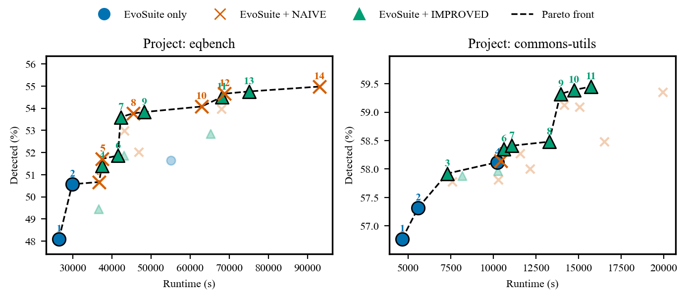
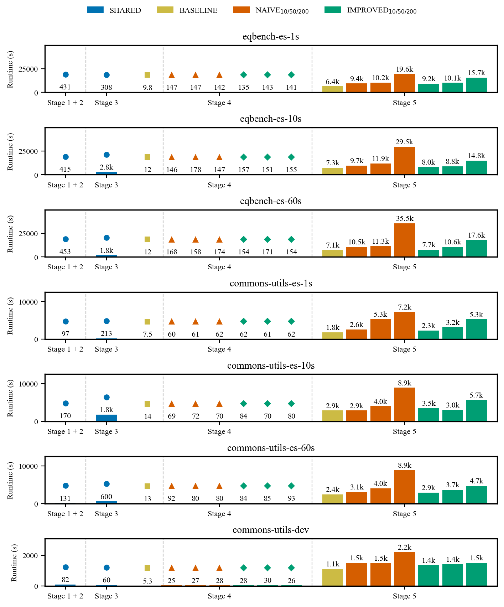
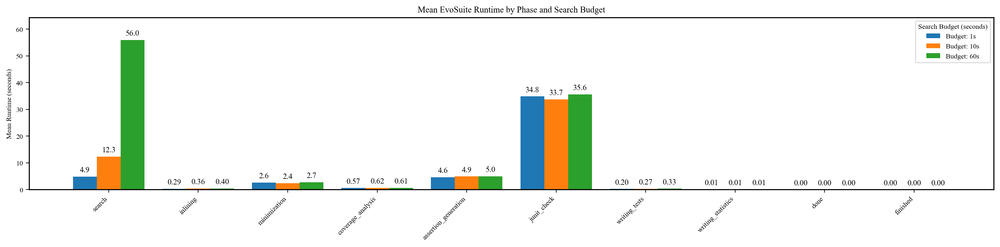

# RQ4 - Efficiency versus EvoSuite

_Source database: `postgres_dev`._

## Efficiency versus EvoSuite

**Pareto points for eqbench.**

| Pt. | EvoSuite | Teralizer | Det. \% | Runtime (s) |
| --- | --- | --- | --- | --- |
| 1 | 1s | - | 48.1 | 26,479 |
| 2 | 10s | - | 50.6 | 29,861 |
| 3 | 1s | NAIVE$_{10}$ | 50.7 | 36,728 |
| 4 | 1s | IMPROVED$_{50}$ | 51.4 | 37,457 |
| 5 | 1s | NAIVE$_{50}$ | 51.7 | 37,532 |
| 6 | 10s | IMPROVED$_{10}$ | 51.9 | 41,525 |
| 7 | 10s | IMPROVED$_{50}$ | 53.6 | 42,256 |
| 8 | 10s | NAIVE$_{50}$ | 53.8 | 45,398 |
| 9 | 10s | IMPROVED$_{200}$ | 53.8 | 48,269 |
| 10 | 10s | NAIVE$_{200}$ | 54.1 | 62,938 |
| 11 | 60s | IMPROVED$_{50}$ | 54.5 | 68,093 |
| 12 | 60s | NAIVE$_{50}$ | 54.7 | 68,782 |
| 13 | 60s | IMPROVED$_{200}$ | 54.8 | 75,081 |
| 14 | 60s | NAIVE$_{200}$ | 55.0 | 93,017 |

source: [`compute_pareto_efficiency_analysis`](https://github.com/glockyco/Teralizer/blob/0a446d9a6d6f2269f4ed22c2e491444ebfd5824a/analysis/src/teralizer/rq3_runtime_requirements.py#L237)

**Pareto points for commons-utils.**

| Pt. | EvoSuite | Teralizer | Det. \% | Runtime (s) |
| --- | --- | --- | --- | --- |
| 1 | 1s | - | 56.8 | 4,649 |
| 2 | 10s | - | 57.3 | 5,597 |
| 3 | 1s | IMPROVED$_{10}$ | 57.9 | 7,294 |
| 4 | 60s | - | 58.1 | 10,240 |
| 5 | 10s | NAIVE$_{10}$ | 58.1 | 10,445 |
| 6 | 10s | IMPROVED$_{50}$ | 58.4 | 10,603 |
| 7 | 10s | IMPROVED$_{10}$ | 58.4 | 11,082 |
| 8 | 10s | IMPROVED$_{200}$ | 58.5 | 13,270 |
| 9 | 60s | IMPROVED$_{10}$ | 59.3 | 13,939 |
| 10 | 60s | IMPROVED$_{50}$ | 59.4 | 14,728 |
| 11 | 60s | IMPROVED$_{200}$ | 59.5 | 15,736 |

source: [`compute_pareto_efficiency_analysis`](https://github.com/glockyco/Teralizer/blob/0a446d9a6d6f2269f4ed22c2e491444ebfd5824a/analysis/src/teralizer/rq3_runtime_requirements.py#L237)

**Pareto fronts for EvoSuite and Teralizer variants across projects.**

source: [`compute_pareto_efficiency_analysis`](https://github.com/glockyco/Teralizer/blob/0a446d9a6d6f2269f4ed22c2e491444ebfd5824a/analysis/src/teralizer/rq3_runtime_requirements.py#L237)

**Teralizer runtime by pipeline stage and variant.**

source: [`compute_stage_runtime_breakdown`](https://github.com/glockyco/Teralizer/blob/0a446d9a6d6f2269f4ed22c2e491444ebfd5824a/analysis/src/teralizer/rq3_runtime_requirements.py#L193)

**Mean EvoSuite runtime per phase, by project and search budget.**

| Project | Budget (s) | Total | Search | Inlining | Minimization | Coverage Analysis | Assertion Generation | Junit Check | Writing Tests |
| --- | --- | --- | --- | --- | --- | --- | --- | --- | --- |
| commons-utils-es-default-10s | 10.00 | 53.31 | 10.15 | 0.07 | 0.80 | 0.07 | 3.86 | 38.30 | 0.04 |
| commons-utils-es-default-1s | 1.00 | 44.27 | 2.10 | 0.04 | 0.81 | 0.06 | 3.35 | 37.86 | 0.04 |
| commons-utils-es-default-60s | 60.00 | 97.52 | 54.48 | 0.06 | 0.51 | 0.06 | 4.39 | 37.97 | 0.05 |
| eqbench-es-default-10s | 10.00 | 54.89 | 12.75 | 0.42 | 2.71 | 0.72 | 5.11 | 32.85 | 0.31 |
| eqbench-es-default-1s | 1.00 | 48.67 | 5.39 | 0.33 | 2.95 | 0.67 | 4.82 | 34.27 | 0.23 |
| eqbench-es-default-60s | 60.00 | 101.24 | 56.30 | 0.47 | 3.13 | 0.72 | 5.07 | 35.16 | 0.38 |

_Each row is the mean over the runs of one project at one search budget._

source: [`compute_evosuite_phase_statistics`](https://github.com/glockyco/Teralizer/blob/0a446d9a6d6f2269f4ed22c2e491444ebfd5824a/analysis/src/teralizer/rq3_runtime_requirements.py#L385)

**Mean EvoSuite runtime by phase and search budget.**

source: [`compute_evosuite_phase_statistics`](https://github.com/glockyco/Teralizer/blob/0a446d9a6d6f2269f4ed22c2e491444ebfd5824a/analysis/src/teralizer/rq3_runtime_requirements.py#L385)
