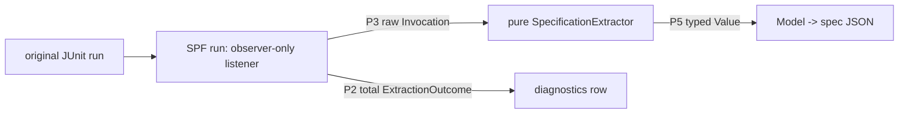

# SPF Specification-Extraction Hardening

## Problem

`teralizer.jpf.TestGeneralizationListener` extracts a path-exact specification by running
SPF (constraint-collection mode, single concrete path) over an instrumented wrapper that
calls one tested method, capturing the concrete + symbolic input/output at the tested
method's return. It is the foundation the whole generator builds on, and it is the source
of the foundational fixes the beyond-JARVIS census surfaced.

Its structure is why those bugs recur. The listener is one mutable, cross-callback state
machine (`recursionDepth`, `isInInstrumentedMethod`, `pendingThrownException`,
`instrumentedInputArguments`) that fuses five concerns — target detection, concrete
capture, symbolic capture, model transformation, and file I/O — in a single
`writeSpecificationFiles`, and collapses every non-success into one untyped
`"Failed to collect … for unknown reason"`. Each census bug is a symptom of that fusion + the untyped
outcome, not an independent defect:

| census symptom | underlying flaw |
|---|---|
| `Integer@24c` rendered as a literal | stringly-typed capture (`String.valueOf` on an `ElementInfo`) |
| crash rendering a null boxed `Boolean`/`Character` seed | value round-tripped as the string `"null"` |
| Postgres insert fails on `0x00` in a throwable message | untyped text shipped straight to the DB |
| unreachable assertion (dead `else`) → `"unknown reason"` | binary "files exist?" outcome (P2 types it `TARGET_NOT_ENTERED`); reaching SPF at all is a MUT-id defect — an unreachable call mis-selected as the MUT |

Three of these have interim point-fixes (typed boxed-wrapper capture; reference-typed
`null` rendering; NUL stripping at the DB boundary). They stop the bleeding but leave the
structure — and the next stringly/untyped edge — intact. This spec defines the target
architecture that makes the whole class structurally impossible, reached incrementally
from today's green baseline.

## Target architecture



Four principles:

- **P2 — one total, typed `ExtractionOutcome` per candidate.** A closed set:
  `EXTRACTED | TARGET_NOT_ENTERED | TARGET_NOT_EXITED | UNSUPPORTED_TERM | PC_TOO_LARGE |
  TIMEOUT | ORACLE_THREW | NATIVE_MODEL_GAP`. Every run maps to exactly one; "unknown" is
  unrepresentable. This is the census diagnostic taxonomy produced at the source instead
  of grepped from stack traces.
- **P5 — typed `Value`s, not strings.** `Primitive | Reference(nullable) | StringValue |
  SymbolicExpr`. The Java renderer pattern-matches on the variant; no identity-hash
  strings, no `"null"`, no raw NUL reaching a downstream parser or the DB.
- **P3 — split at the SPF→Model seam.** The listener stays minimal: capture concrete in/out
  (typed) and transform the symbolic PC + return term to the `Model` *at capture* — during the
  run, where the SPF objects are valid (exactly where production transforms today, so it is
  already proven). It records that `Invocation` plus an observable state snapshot and does no file
  I/O. Outcome classification and `Model`→JSON + file I/O run *after* `jpf.run()` in a pure step
  that touches only `Model` POJOs, never SPF objects — so post-run SPF-object validity is never
  assumed. The bug-prone parts (typed values, typed outcome, I/O) sit on the pure side.
- **P4 — identify the target by clone-stable frame position, not a mutable counter.** JPF
  clones frozen frames and exposes no stable per-frame id, and `StackFrame.equals` compares slot
  state, so a frame object reference cannot identify an invocation across the search. The identity
  is the frame's stack position (`StackFrame.getDepth()`, copied verbatim by `clone()`): pin it at
  the first tested entry reached from the wrapper and match the exit at that position — the
  outermost frame under recursion. (`leave()` notifies `methodExited` before `popFrame()`, so the
  exiting frame is still readable.) *Which* call is the target is decided upstream: instrumentation
  lifts exactly one tested call into a uniquely-named marker wrapper, so the listener never chooses
  among calls. Deletes the `recursionDepth`/`isInInstrumentedMethod`/`pendingThrownException` dance.

Contract sketches (Java 8 — no records/sealed; tagged classes + enums):

```java
final class ExtractionOutcome {
    enum Kind { EXTRACTED, TARGET_NOT_ENTERED, TARGET_NOT_EXITED, UNSUPPORTED_TERM,
                PC_TOO_LARGE, TIMEOUT, ORACLE_THREW, NATIVE_MODEL_GAP }
    final Kind kind;
    final String detail;          // human-readable, never null
    final Invocation invocation;  // non-null iff kind == EXTRACTED
}

abstract class Value { /* PrimitiveValue | ReferenceValue(nullable) | StringValue | SymbolicValue */ }

final class Invocation {          // captured during the run; holds Model POJOs, not SPF objects
    final List<Value>                 concreteIn;
    final teralizer.domain.Expression modelInput;   // PC transformed to Model at capture
    final Value                       concreteOut;  // or…
    final CapturedException           thrown;       // …exactly one of these
    final teralizer.domain.Expression modelOutput;  // return term transformed to Model at capture
}

interface SpecificationExtractor {                 // pure; only Model POJOs, no JPF/SPF
    void write(Invocation invocation);             // Model -> JSON -> spec files, fully unit-testable
}

// Observable listener state, read by JpfExecutionTask to classify (no "unknown reason"):
final class ListenerState { boolean wrapperEntered, targetEntered, targetExited, specCaptured; }
```

## Incremental sequence

Each phase is independently shippable and verified (harness unit tests + a clean PIT-free
census re-run) before the next starts. Order minimizes risk: typed outcomes first (immediate
diagnostic correctness, no behavior change for the success path), then the observer boundary
that makes the rest unit-testable, then value typing and frame identity on that testable base.

### Phase 1 — typed outcome + observer boundary (P2 + P3)

The listener stops transforming/writing inside `methodExited`; it records the raw
`Invocation` + `ListenerState`. `JpfExecutionTask` runs the extractor post-run and maps the
result to an `ExtractionOutcome`: a captured invocation → `EXTRACTED`; no `Invocation` with
`targetEntered == false` → `TARGET_NOT_ENTERED` (the isAscii dead-`else` case); `targetEntered
&& !targetExited` → `TARGET_NOT_EXITED`; the existing throw-classifying hooks map to
`PC_TOO_LARGE` / `TIMEOUT` / `NATIVE_MODEL_GAP`. The `"unknown reason"` string is deleted.

- Files: `src/main/java/teralizer/jpf/TestGeneralizationListener.java`,
  `src/main/java/teralizer/processing/task/JpfExecutionTask.java`,
  new `src/main/java/teralizer/jpf/{Invocation,ExtractionOutcome,SpecificationExtractor}.java`.
- Tests: extend `src/test/java/teralizer/jpf/JpfListenerHarness.java` to return the
  `ExtractionOutcome`; add a `targets/UnreachableTargetWrapper` whose wrapper never calls the
  tested method → asserts `TARGET_NOT_ENTERED`; keep existing capture/outcome/symbolic tests
  green (now asserting `EXTRACTED`).
- Acceptance: every EXECUTE_JPF result carries a typed kind; the census run's isAscii row is
  `TARGET_NOT_ENTERED`, not a failure; no `"unknown reason"` anywhere.

### Phase 2 — typed values (P5)

Introduce the `Value` model. The listener's capture produces `Value`s (primitives boxed to
host wrappers; null references as `Reference(null)`; strings via `ElementInfo.asString()`;
symbolic terms as `SymbolicExpr`). `ModelToJavaTransformer` and the diagnostic writer consume
`Value`s, not re-parsed strings. The interim boxed-capture and `"null"`-rendering point-fixes
become properties of the typed model; their string special-cases are removed. `stripNul` stays —
it guards a separate boundary (the jqwik-diagnostic→DB write in `JunitDataCollectionTask`), not
the capture→render flow the typed model covers.

- Files: new `src/main/java/teralizer/jpf/Value*.java`; `TestGeneralizationListener` capture
  helpers; `src/main/java/teralizer/transformer/ModelToJavaTransformer.java`;
  `src/main/java/teralizer/processing/task/JunitDataCollectionTask.java` (diagnostic text).
- Tests: harness asserts a typed null boxed `Boolean`/`Character` and a `char`-0 string render
  to valid Java; the existing `ModelToJavaTransformerTypeSupportTest` null/primitive cases hold.
- Acceptance: no `String.valueOf`/`toString`-on-`ElementInfo` in capture; no `"null"`/identity
  strings; a NUL-bearing value never reaches a parser or the DB.

### Phase 3 — frame-identity target detection (P4)

Replace `recursionDepth` + `isInInstrumentedMethod` + the entry/exit matching with capture keyed
on the tested-method frame's stack depth, pinned at the first entry reached from the wrapper; the
write trigger is that exact frame's exit, captured once. Relies on the single constraint-collection
path (no backtracking), documented in the listener. Removes the mutable counters.

- Files: `TestGeneralizationListener`.
- Tests: `TestGeneralizationListenerInvocationSelectionTest` — a recursive tested method (asserts
  the outermost frame is captured) and a looped wrapper (asserts the first invocation, not the last).
- Acceptance: capture is correct for recursive/nested targets; no behavior change for the ~210
  currently-handled assertions.

### Phase 4 — reachability gate (rejected)

Not implemented; superseded by stronger MUT identification. A dead-`else` assertion reaches SPF
only because MUT-id (LCBA — last call before assert) selected a call the test never executes, and
an unreachable call cannot be the method under test. A coverage-based pre-filter would mask that
misidentification rather than fix it — and would still admit *reachable* non-MUT calls (LCBA
picking `getState()` over `setState()`), so it sits at the wrong layer. The dead-`else` case is
already handled at runtime as P2's `TARGET_NOT_ENTERED`, recorded as an exclusion. The root fix is
demoting LCBA to one signal in a focal-method ensemble: `2026-06-27-ensemble-mut-identification`
(design + evidence), with concrete targets and oracle-coverage data in
`2026-06-28-mut-id-targeting-and-coverage`.

## Key decisions (for review)

1. **Phasing** — incremental as above (recommended), vs. a clean-room rewrite. Incremental
   keeps the ~210 working assertions green throughout.
2. **Reachability gate (Phase 4)** — rejected. The dead-`else` is a MUT-identification defect
   (an unreachable call chosen as the MUT), not a missing reachability filter; a coverage gate
   masks it and still admits reachable non-MUT calls. Handled at runtime by P2's
   `TARGET_NOT_ENTERED`; root fix in `2026-06-27-ensemble-mut-identification`.
3. **Path contract** — keep the concrete-path-exact, single-path semantics
   (`symbolic.collect_constraints=true`); confirmed intended, not "first of many."
4. **`ExtractionOutcome` recording** — `TARGET_NOT_ENTERED` / `UNSUPPORTED_TERM` etc. are
   recorded as **exclusions** (not pipeline failures), matching how the census scorecard and
   the run-script failure-check already treat per-assertion JPF gaps.

## Acceptance criteria

- No `"unknown reason"` (or any untyped catch-all) reachable; every EXECUTE_JPF result is one
  `ExtractionOutcome.Kind`.
- The three value-bug classes are structurally impossible: capture and rendering operate on
  typed `Value`s; no stringly round-trip; no NUL reaches a parser/DB.
- The transformation + serialization path is pure and unit-tested via `JpfListenerHarness`
  for each outcome kind and each value kind.
- The full Java suite passes — the harness outcome/value cases plus
  `TestGeneralizationListenerInvocationSelectionTest` (recursion/loop selection). **Outstanding:**
  a PIT-free census re-run reporting typed per-assertion exclusions with **zero** breakage
  (build/collect/generalize/execute) and no regression in the `EXTRACTED` count vs. baseline —
  needs the DB/pipeline and gates the move to `implemented`.

## Out of scope

- Closing the model gaps themselves (the 154 `NoSuchMethodException` CNFEs / native peers) —
  `2026-06-28-native-peer-model-coverage`.
- PIT-at-scale and generated-build robustness — `2026-06-30-census-build-robustness-and-pit-scale`.
- The generator/planner downstream of the spec — `2026-06-28-clause-driven-input-generation`.
